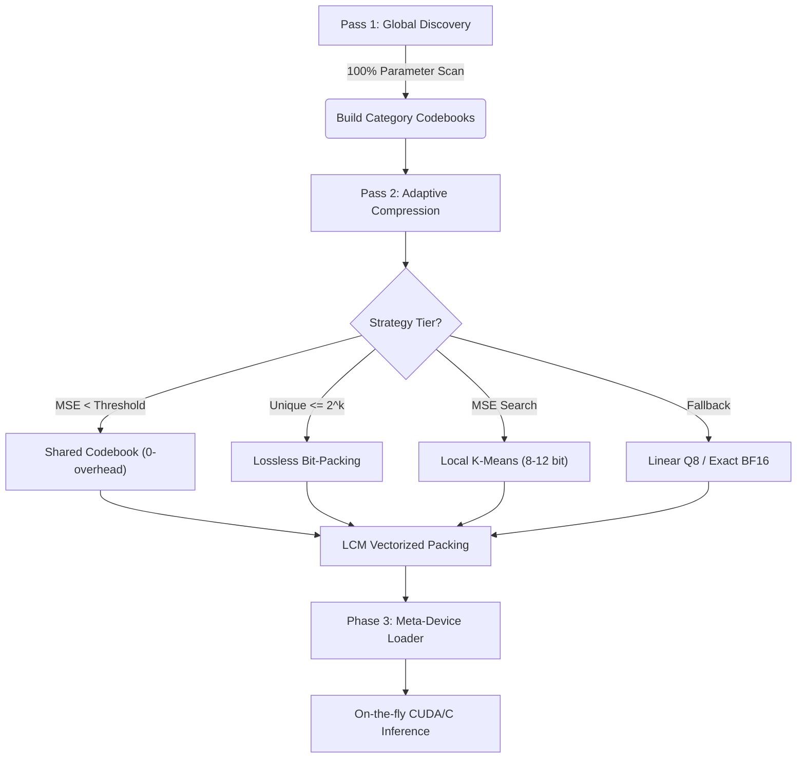

# Adaptive Codebook Compression (ACC) — Algorithm Specification

Adaptive Codebook Compression (ACC) is a high-performance, two-pass quantization and inference framework designed to run large language models on memory-constrained hardware. Unlike standard uniform quantization (e.g., INT8/FP4), ACC uses non-uniform codebooks optimized for the specific distribution of each model.

---

## Algorithm Flow



---

## Phase 1: Global Discovery (Histogram Analysis)

Instead of sampling, ACC performs a 100% coverage scan of every parameter in the original model to build a precise "vocabulary" of its weights.

```text
ALGORITHM GlobalDiscovery(model_shards):
    INITIALIZE histograms for each category (Embedding, Attention, MLP, etc.)
    
    FOR EACH shard IN model_shards:
        FOR EACH weight_tensor IN shard:
            category = Classify(weight_tensor.name)
            
            // 100% Coverage: Count occurrences of every unique BF16 value
            FOR EACH value IN weight_tensor:
                histograms[category][value].increment()
            
    FOR EACH category, hist IN histograms:
        uniques = hist.get_nonzero_values()
        
        IF length(uniques) <= target_k:
            // Bit-Perfect path: All unique values fit in the codebook
            codebooks[category] = SORT(uniques)
        ELSE:
            // Lossy path: Cluster values weighted by their frequency
            codebooks[category] = WeightedKMeans(uniques, weights=hist.counts, k=target_k)
    
    RETURN codebooks
```

---

## Phase 2: Streaming Adaptive Compression (Optimization)

This pass processes tensors **serially** (one-by-one) to keep peak RAM equal to a single tensor's size. Each layer "hunts" for the smallest bit-width that satisfies its specific MSE threshold.

### 2a. Multi-Tier Strategy Selection

```text
ALGORITHM AdaptiveCompressor(tensor, global_cb, threshold):
    // Tier 0: Guardrails for tiny or sensitive layers
    IF is_critical(tensor) OR tensor.size < 1000:
        RETURN ExactStorage(tensor, dtype=BF16)

    // Tier 1: Shared Global Codebook (Zero Storage Overhead)
    mse = CalculateMSE(tensor, global_cb)
    IF mse <= threshold:
        indices = MapToNearest(tensor, global_cb)
        RETURN PackedIndices(indices, codebook=GLOBAL, bits=log2(global_cb.size))

    // Tier 2: Adaptive Local Codebook (Bit-Width Search)
    FOR bits FROM 8 TO 12:
        IF UniqueCount(tensor) <= 2^bits:
            // Lossless Local: All values fit exactly
            indices = MapToUnique(tensor)
            RETURN PackedIndices(indices, codebook=LOCAL, bits=bits)
            
        // Lossy Local: Test K-Means on a representative sample
        sample = tensor.random_sample(50000)
        centroids = KMeans(sample, k=2^bits)
        IF CalculateMSE(sample, centroids) <= threshold:
            indices = MapToNearest(tensor, centroids)
            RETURN PackedIndices(indices, codebook=LOCAL, bits=bits)

    // Tier 3: Fallback
    RETURN LinearQuantization8Bit(tensor) OR ExactStorage(tensor)
```

### 2b. Technical Innovation: LCM Bit-Packing

Standard integer containers (e.g., `uint16` for 13-bit indices) waste significant space. ACC uses a **Vectorized Group Packing** algorithm to solve the "bit-waste" problem by aligning blocks of indices to byte boundaries.

```text
ALGORITHM LCM_Group_Packing(indices, bits):
    // 1. Calculate Group Alignment via LCM
    group_lcm = LCM(bits, 8)
    values_per_group = group_lcm / bits
    bytes_per_group = group_lcm / 8

    // 2. Process in Groups (Vectorized)
    FOR EACH group OF values_per_group indices:
        INITIALIZE lo, hi as 64-bit registers (0)
        
        FOR i FROM 0 TO values_per_group - 1:
            val = group[i]
            bit_start = i * bits
            
            IF bit_start + bits <= 64:
                lo |= (val << bit_start)            // Fits in lower register
            ELSE IF bit_start >= 64:
                hi |= (val << (bit_start - 64))     // Fits in upper register
            ELSE:
                lo_bits = 64 - bit_start            // Spans the 64-bit boundary
                lo |= (val << bit_start)
                hi |= (val >> lo_bits)
        
        // 3. Write Registers to Byte Stream
        APPEND first_8_bytes(lo) TO bitstream
        IF bytes_per_group > 8:
            APPEND remaining_bytes(hi) TO bitstream
            
    RETURN bitstream
```

```text
ALGORITHM LCM_Group_Unpacking(bitstream, bits, target_count):
    FOR EACH group_bytes IN bitstream:
        LOAD lo, hi registers from group_bytes
        
        FOR i FROM 0 TO values_per_group - 1:
            bit_start = i * bits
            mask = (1 << bits) - 1
            
            IF bit_start + bits <= 64:
                val = (lo >> bit_start) & mask
            ELSE IF bit_start >= 64:
                val = (hi >> (bit_start - 64)) & mask
            ELSE:
                lo_bits = 64 - bit_start            // Reconstruct from both
                val = (lo >> bit_start) | ((hi & MASK(bits-lo_bits)) << lo_bits)
                
            APPEND val TO indices
            
    RETURN indices[0...target_count]
```

---

## Phase 3: Meta-Device Inference (Execution)

ACC ensures that a large model (e.g., 20GB) can be loaded into limited VRAM (e.g., 8GB) by never materializing the full uncompressed weights.

1.  **Meta-Skeleton:** Initialized on PyTorch `meta` device (0 memory allocation).
2.  **Empty Materialization:** `to_empty(device)` allocates storage ONLY for compressed indices and codebooks.
3.  **On-the-fly CUDA Decompression:** Custom kernels perform matrix multiplication by unpacking indices and looking up codebook values in the inner loop.

```cpp
// Pseudocode for CUDA Decompression Kernel
__global__ void compressed_linear_kernel(...) {
    // Each block handles one output feature out[tok, ofeat]
    float acc = 0;
    for (int k = tid; k < K; k += 256) {
        // UNPACK: indices are bit-streamed (e.g., 11 bits)
        // No float weight matrix is ever created in VRAM.
        int idx = unpack_bitstream(packed_weights, k, bits);
        
        // LOOKUP + DOT: codebook is small (~32KB) and stays in L2/SRAM
        acc += input[k] * codebook[idx];
    }
    output[out_feat] = block_reduce_sum(acc);
}
```

---

## Key Metrics (Qwen3.5-0.8B Example)

| Feature | Implementation |
| :--- | :--- |
| **Precision** | Variable (3 to 15 bits, per-layer adaptive) |
| **Bitstream Alignment** | LCM-grouped bit-packing (vectorized) |
| **Codebook Type** | Distribution-aware (K-Means) or Lossless (LUT) |
| **Peak RAM** | ~Compressed size + single-tensor buffer |
| **Inference Engine** | JIT-compiled custom CUDA/C kernels |
