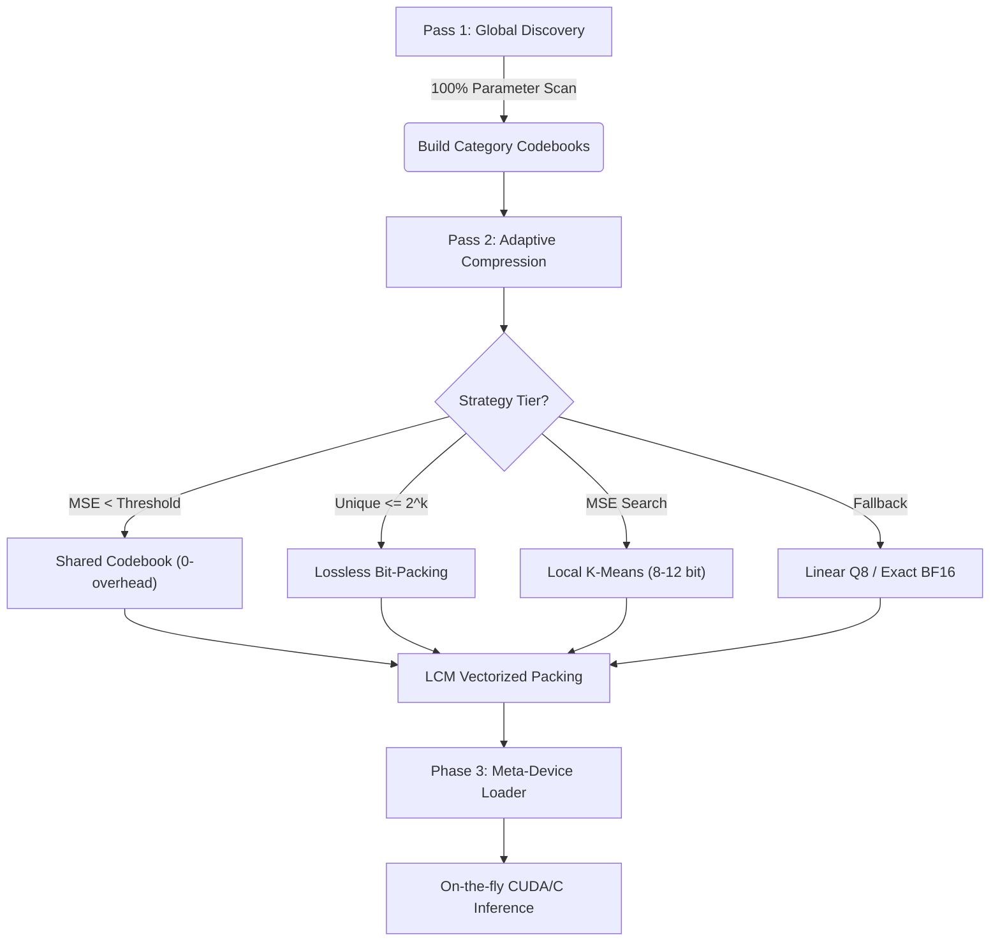

# Adaptive Codebook Compression (ACC) — Algorithm Specification

Adaptive Codebook Compression (ACC) is a high-performance, two-pass quantization and inference framework designed to run large language models on memory-constrained hardware. Unlike standard uniform quantization (e.g., INT8/FP4), ACC uses non-uniform codebooks optimized for the specific distribution of each model.

---

## Algorithm Flow



---

## Phase 1: Global Discovery (Histogram Analysis)

Instead of sampling, ACC performs a 100% coverage scan of every parameter in the original model to build a precise "vocabulary" of its weights.

```text
ALGORITHM GlobalDiscovery(model_shards):
    INITIALIZE histograms for each category (Embedding, Attention, MLP, etc.)
    
    FOR EACH shard IN model_shards:
        FOR EACH weight_tensor IN shard:
            category = Classify(weight_tensor.name)
            
            // 100% Coverage: Count occurrences of every unique BF16 value
            FOR EACH value IN weight_tensor:
                histograms[category][value].increment()
            
    FOR EACH category, hist IN histograms:
        uniques = hist.get_nonzero_values()
        
        IF length(uniques) <= target_k:
            // Bit-Perfect path: All unique values fit in the codebook
            codebooks[category] = SORT(uniques)
        ELSE:
            // Lossy path: Cluster values weighted by their frequency
            codebooks[category] = WeightedKMeans(uniques, weights=hist.counts, k=target_k)
    
    RETURN codebooks
```

---

## Phase 2: Streaming Adaptive Compression (Optimization)

This pass processes tensors **serially** (one-by-one) to keep peak RAM equal to a single tensor's size. Each layer "hunts" for the smallest bit-width that satisfies its specific MSE threshold.

### 2a. Multi-Tier Strategy Selection

```text
ALGORITHM AdaptiveCompressor(tensor, global_cb, threshold):
    // Tier 0: Guardrails for tiny or sensitive layers
    IF is_critical(tensor) OR tensor.size < 1000:
        RETURN ExactStorage(tensor, dtype=BF16)

    // Tier 1: Shared Global Codebook (Zero Storage Overhead)
    mse = CalculateMSE(tensor, global_cb)
    IF mse <= threshold:
        indices = MapToNearest(tensor, global_cb)
        RETURN PackedIndices(indices, codebook=GLOBAL, bits=log2(global_cb.size))

    // Tier 2: Adaptive Local Codebook (Bit-Width Search)
    FOR bits FROM 8 TO 12:
        IF UniqueCount(tensor) <= 2^bits:
            // Lossless Local: All values fit exactly
            indices = MapToUnique(tensor)
            RETURN PackedIndices(indices, codebook=LOCAL, bits=bits)
            
        // Lossy Local: Test K-Means on a representative sample
        sample = tensor.random_sample(50000)
        centroids = KMeans(sample, k=2^bits)
        IF CalculateMSE(sample, centroids) <= threshold:
            indices = MapToNearest(tensor, centroids)
            RETURN PackedIndices(indices, codebook=LOCAL, bits=bits)

    // Tier 3: Fallback
    RETURN LinearQuantization8Bit(tensor) OR ExactStorage(tensor)
```

### 2b. Technical Innovation: LCM Bit-Packing

Standard integer containers (e.g., `uint16` for 13-bit indices) waste significant space. ACC uses a **Vectorized Group Packing** algorithm to solve the "bit-waste" problem by aligning blocks of indices to byte boundaries.

```text
ALGORITHM LCM_Group_Packing(indices, bits):
    // 1. Calculate Group Alignment via LCM
    group_lcm = LCM(bits, 8)
    values_per_group = group_lcm / bits
    bytes_per_group = group_lcm / 8

    // 2. Process in Groups (Vectorized)
    FOR EACH group OF values_per_group indices:
        INITIALIZE lo, hi as 64-bit registers (0)
        
        FOR i FROM 0 TO values_per_group - 1:
            val = group[i]
            bit_start = i * bits
            
            IF bit_start + bits <= 64:
                lo |= (val << bit_start)            // Fits in lower register
            ELSE IF bit_start >= 64:
                hi |= (val << (bit_start - 64))     // Fits in upper register
            ELSE:
                lo_bits = 64 - bit_start            // Spans the 64-bit boundary
                lo |= (val << bit_start)
                hi |= (val >> lo_bits)
        
        // 3. Write Registers to Byte Stream
        APPEND first_8_bytes(lo) TO bitstream
        IF bytes_per_group > 8:
            APPEND remaining_bytes(hi) TO bitstream
            
    RETURN bitstream
```

```text
ALGORITHM LCM_Group_Unpacking(bitstream, bits, target_count):
    FOR EACH group_bytes IN bitstream:
        LOAD lo, hi registers from group_bytes
        
        FOR i FROM 0 TO values_per_group - 1:
            bit_start = i * bits
            mask = (1 << bits) - 1
            
            IF bit_start + bits <= 64:
                val = (lo >> bit_start) & mask
            ELSE IF bit_start >= 64:
                val = (hi >> (bit_start - 64)) & mask
            ELSE:
                lo_bits = 64 - bit_start            // Reconstruct from both
                val = (lo >> bit_start) | ((hi & MASK(bits-lo_bits)) << lo_bits)
                
            APPEND val TO indices
            
    RETURN indices[0...target_count]
```

---

## Phase 2c: Optional Huffman Entropy Coding (--entropy-code)

Standard fixed-width bit-packing (LCM packing) encodes every index with the
same number of bits, ignoring how often each value appears.  This wastes bits
on rare values and under-utilises the fact that common weight values occur far
more often than rare ones.

**Key insight:** the codebook already sorts entries by frequency (index 0 = most
common BFloat16 value).  The index distribution therefore has Shannon entropy
H ≈ 10 bits, while fixed-width packing uses 13 bits — an 18% gap.

Huffman coding assigns short codes to common indices and long codes to rare ones,
closing that gap without any loss of precision.

```text
ALGORITHM HuffmanEncode(indices, bits):
    // 1. Count symbol frequencies
    freq[sym] = count(sym in indices)  for sym in 0..2^bits-1

    // 2. Build optimal code lengths (Huffman tree → canonical form)
    //    Common symbols: short codes (e.g. 3 bits for top index)
    //    Rare symbols:   long codes  (e.g. 20 bits for rarest index)
    lengths = BuildCanonicalHuffman(freq)           // stored in NPZ

    // 3. Encode bitstream (MSB-first per byte, same convention as DFloat11)
    FOR EACH sym IN indices:
        APPEND canonical_code(sym, lengths) TO bitstream

    RETURN (bitstream, lengths)   // lengths is all that's needed to decode

ALGORITHM HuffmanDecode(bitstream, lengths, n):
    // Rebuild canonical codes from lengths (deterministic)
    codes = RebuildCanonical(lengths)
    // 16-bit LUT for O(1) decode of codes ≤ 16 bits (>99% of symbols)
    lut = BuildDecodeLUT(codes, lut_bits=16)
    FOR i IN 0..n-1:
        sym = LUT_lookup(bitstream, lut)   // O(1) fast path
        indices[i] = sym
    RETURN indices
```

**Expected compression gain:** ~18% on top of existing LCM bit-packing
(validated on Qwen3.5-0.8B; varies by model weight distribution).

**Relationship to DFloat11:**

DFloat11 (Zhao et al. 2025, https://arxiv.org/abs/2412.19437) applies the same
Huffman insight to BFloat16 **exponent bytes** — they are non-uniform because
most weights are small, so exponents cluster around a few values.
ACC with `--entropy-code` applies Huffman to **full codebook indices**, which
exploits the joint value distribution rather than just the exponent component.
The two techniques are complementary:

| Technique      | What it codes     | Distribution exploited       | Lossless? |
|----------------|-------------------|------------------------------|-----------|
| DFloat11       | BF16 exponent (8 bit) | Exponent magnitude skew   | Yes       |
| ACC fixed-width| Codebook index (13 bit) | Value repetition only    | Yes       |
| ACC + Huffman  | Codebook index (variable) | Full value distribution  | Yes       |

**Storage:** replaces `indices` (uint8 LCM-packed) with:
- `huff_lengths` uint8[C] — canonical code lengths (2-3 KB per tensor)
- `huff_stream` uint8[N_B] — compressed bitstream (~18% smaller than packed)

**Inference (Phase 1):** CPU decodes Huffman → LCM-packed → existing GPU kernel.
No VRAM savings at inference time; disk/RAM savings only.

**Inference (Phase 2, implemented):** GPU Huffman kernel (see `src/gpu_huffman_functions.py`)
decodes the stream on-device during each forward pass.  The Huffman-compressed
stream lives in VRAM permanently (~18% smaller than LCM-packed), and a transient
int32 index buffer is created per forward call then freed.  Phase 2 is selected
automatically when CUDA is available and the GPU decode tables (`huff_lut_sym`,
`huff_row_bit_starts`, etc.) are present in the cache — both produced by default
when `--entropy-code` is used.  The kernel architecture follows DFloat11's
12-bit LUT + slow-path design but uses a simpler decode-then-matmul structure
rather than a fully fused single-pass kernel.

---

## Phase 3: Meta-Device Inference (Execution)

ACC ensures that a large model (e.g., 20GB) can be loaded into limited VRAM (e.g., 8GB) by never materializing the full uncompressed weights.

1.  **Meta-Skeleton:** Initialized on PyTorch `meta` device (0 memory allocation).
2.  **Empty Materialization:** `to_empty(device)` allocates storage ONLY for compressed indices and codebooks.
3.  **On-the-fly CUDA Decompression:** Custom kernels perform matrix multiplication by unpacking indices and looking up codebook values in the inner loop.

```cpp
// Pseudocode for CUDA Decompression Kernel
__global__ void compressed_linear_kernel(...) {
    // Each block handles one output feature out[tok, ofeat]
    float acc = 0;
    for (int k = tid; k < K; k += 256) {
        // UNPACK: indices are bit-streamed (e.g., 11 bits)
        // No float weight matrix is ever created in VRAM.
        int idx = unpack_bitstream(packed_weights, k, bits);
        
        // LOOKUP + DOT: codebook is small (~32KB) and stays in L2/SRAM
        acc += input[k] * codebook[idx];
    }
    output[out_feat] = block_reduce_sum(acc);
}
```

---

## Key Metrics (Qwen3.5-0.8B Example)

| Feature | Implementation |
| :--- | :--- |
| **Precision** | Variable (3 to 15 bits, per-layer adaptive) |
| **Bitstream Alignment** | LCM-grouped bit-packing (vectorized) |
| **Codebook Type** | Distribution-aware (K-Means) or Lossless (LUT) |
| **Peak RAM** | ~Compressed size + single-tensor buffer |
| **Inference Engine** | JIT-compiled custom CUDA/C kernels |

## Compression Technique Comparison

| Technique | Size vs BF16 | Lossless | VRAM during inference |
|-----------|-------------|----------|----------------------|
| ACC lossless (default) | ~77% | Yes | ~77% (indices in VRAM) |
| ACC lossless + `--entropy-code` | ~63% | Yes | ~63% (Phase 2) / ~77% (Phase 1) |
| DFloat11 | ~72% | Yes | ~72% (full BF16 decompressed per layer) |
| GPTQ INT4 | ~25% | No (lossy) | ~25% |
| GGUF Q4_K_M | ~28% | No (lossy) | ~28% |

Phase 1 (`--entropy-code`, CPU fallback): Huffman decoded to LCM-packed at load;
VRAM unchanged, disk/RAM savings only.
Phase 2 (`--entropy-code`, CUDA available): Huffman stream stored in VRAM;
decoded by GPU kernel per forward pass; VRAM savings match disk savings.

## References

- DFloat11: "No Free Lunch in Neural Network Compression" (Zhao et al., 2025)
  https://arxiv.org/abs/2412.19437 — Huffman coding of BF16 exponent bytes
- Canonical Huffman codes: RFC 1951 (DEFLATE format), §3.2.2
- DFloat11 GPU kernel source: https://github.com/LeanModels/DFloat11
